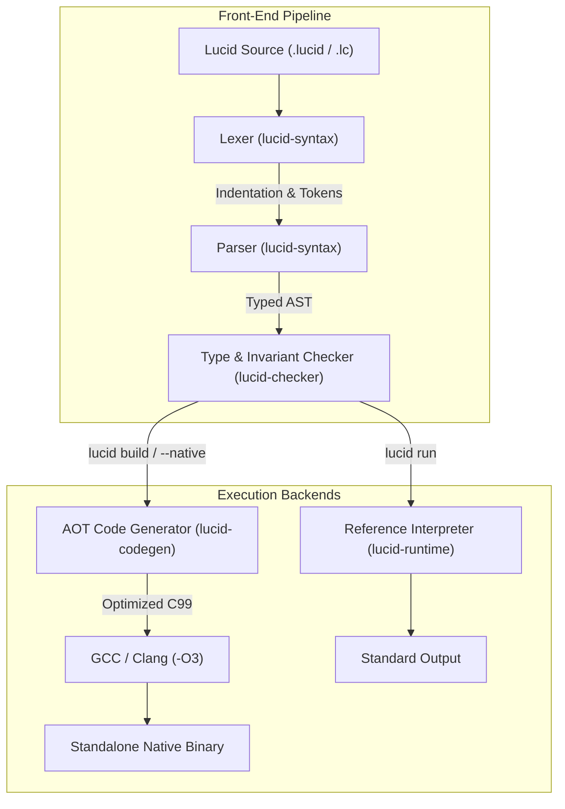

# Compiler and runtime architecture

Lucid separates language validation from code execution. The toolchain
processes a program through three distinct stages: syntactic analysis, static
verification, and execution.

Execution provides two backends: an ahead-of-time native compiler that emits
optimized machine code through C99, and a tree-walking reference interpreter
for interactive evaluation and debugging.

The implementation is structured as a Cargo workspace in `compiler/crates/`:

* `lucid-syntax`: Lexer, token stream, and recursive-descent parser.
* `lucid-checker`: Static semantic analysis, type checking, and invariant
  validation.
* `lucid-codegen`: Native code generator emitting C99 machine code via GCC.
* `lucid-runtime`: Tree-walking evaluator, value representations, and
  built-in functions.
* `lucid-cli`: Unified command-line driver uniting compilation, execution,
  type checking, and the interactive read-eval-print loop.

## Pipeline stages

Every source file moves through a linear front-end pipeline before entering an
execution backend:

1. The lexer scans UTF-8 source text, translates whitespace indentation into
   indent and dedent tokens, and produces a token stream.
2. The parser organizes tokens into a typed abstract syntax tree rooted in a
   module declaration.
3. The static checker verifies types, validates single inheritance, enforces
   interface contracts, checks pattern exhaustiveness, and checks mutability
   permissions.
4. The execution driver dispatches the verified tree either to the native code
   generator or to the reference interpreter.



## Front-end: syntax and parser

The `lucid-syntax` crate converts source text into an abstract syntax tree.

### Lexical analysis

The lexer tracks source line and column numbers while resolving whitespace
indentation depths. It maintains an internal stack of active indentation
levels:

* When a line begins at a greater indentation depth than the stack top, the
  lexer pushes the new depth and emits an *indent token*, which marks an
  enclosing block.
* When a line begins at a lesser indentation depth, the lexer pops depths until
  matching the active level, emitting a *dedent token* for each popped depth.
* When indentation does not match any enclosing level on the stack, the lexer
  reports an indentation error.

This indentation mechanism removes the need for braces while preserving unambiguous
block structure.

### Syntactic parsing

The parser uses recursive descent with precedence climbing for binary
expressions. It produces an abstract syntax tree rooted in the `Module` node.

The syntax tree preserves language semantics:

* Distinct declaration nodes for `interface`, `trait`, and `class` types,
  enforcing the separation between obligations, reusable behavior, and owned
  state.
* Explicit mutability annotations on type references: mutable `T`, read-only
  view `&T`, and deeply immutable object `!T`.
* Multiple dispatch annotations on operator definitions: `dispatch def`.
* Error propagation syntax: the postfix `?` operator on expressions.

## Static checker: semantic analysis

The `lucid-checker` crate validates programs before evaluation or code
generation begins.

### Type checking and inference

Lucid uses bidirectional type checking. Function signatures require explicit
parameter and return types. Within function bodies, local variable types infer
from initial assignments unless explicitly annotated.

The checker rejects mismatched assignments, invalid function arguments, and
undefined attribute accesses at compile time.

### Contract and inheritance validation

The checker enforces structural rules defined in the specification:

* An *interface* specifies abstract obligations without method bodies or
  state. The checker verifies that any concrete class declaring conformance
  implements every required method with an identical signature.
* A *trait* provides reusable method bodies without fields. The checker
  ensures traits compose into classes without conflicting method
  implementations.
* A *class* defines owned state and constructors. The checker rejects any
  class declaration specifying more than one parent class.

### Pattern exhaustiveness

The `match` statement requires complete pattern coverage over variant types
and algebraic shapes. The checker analyzes all match branches against the
target type. When an unhandled case exists, compilation halts with an error
identifying the missing pattern.

### Mutability verification

Lucid tracks mutability permissions through three view types:

* A *mutable reference*, written as `T`, permits field mutation.
* A *read-only view*, written as `&T`, forbids mutating attributes through
  this reference while permitting reads.
* A *deeply immutable object*, written as `!T`, guarantees that neither the
  instance nor any transitively reachable field mutates.

The checker rejects attribute mutation statements whenever the target
expression evaluates to a read-only view or a deeply immutable object.

## Native code generation

The `lucid-codegen` crate translates the verified abstract syntax tree into
optimized machine code by targeting C99.

### Execution model

Dynamic languages often box numbers in heap wrappers and execute bytecode
through virtual dispatch loops. Lucid compiles directly to native instructions
using GCC or Clang:

```bash
lucid build program.lucid -o program
```

The code generator emits a standalone C99 source file and invokes `gcc -O3`
with link-time optimizations to produce a machine binary.

### Unboxed hardware representations

Primitive types map directly to machine registers:

* The `Int` type maps to `int64_t`.
* The `Float` type maps to `double`.
* The `Bool` type maps to `bool`.

Arithmetic operations compile to native CPU instructions (such as `addq`,
`imulq`, and `sqrtsd`) without heap allocations, type tag inspections, or
reference counting checks.

### Contiguous memory layout

Fixed-size arrays allocate contiguous flat memory buffers:

```c
double* a = (double*)malloc(n * sizeof(double));
```

Indexed loops access memory through stride pointer offsets. This layout avoids
pointer chasing, keeps data inside CPU cache lines, and lets the C compiler
vectorize inner loops with SIMD instructions.

### Hardware call stacks

Function invocations translate directly to machine calls:

```c
int64_t fib(int64_t n) {
    if (n <= 1) return n;
    return fib(n - 1) + fib(n - 2);
}
```

Because calls use native CPU stack frames rather than heap-allocated virtual
frames, recursive algorithms and tight loops incur zero interpreter dispatch
overhead.

## Reference interpreter

The `lucid-runtime` crate provides an alternative tree-walking execution
engine.

### Value representation

The interpreter represents runtime values using a tagged enum:

* Primitive values: integers, floating-point numbers, booleans, and strings.
* Collection values: lists, dictionaries, sets, and anonymous records.
* Callable values: user functions, closures, and built-in primitives.
* Object instances: class instances storing field tables and parent pointers.

### Dynamic environment

The interpreter maintains lexical environment frames. When entering a scope,
the runtime allocates an environment record holding local variables and a
pointer to the parent scope.

The reference interpreter executes source files directly without requiring a C
compiler:

```bash
lucid run program.lucid
```

### Interactive REPL

The interpreter powers the interactive read-eval-print loop:

```bash
lucid repl
```

The REPL persists definitions across input lines, allowing immediate
experimentation with algorithms, traits, and types.

## Developer tooling and commands

The `lucid-cli` crate provides the command-line driver for the language:

* `lucid check <file>`: Runs the lexer, parser, and static type checker,
  reporting compile errors without executing code.
* `lucid build <file> -o <bin>`: Emits C99 code, compiles with GCC at `-O3`,
  and outputs a standalone native executable.
* `lucid run --native <file>`: Compiles and runs the file natively in a
  single step.
* `lucid run <file>`: Runs the file through the reference tree-walking
  interpreter.
* `lucid emit-c <file>`: Prints the generated C99 code to standard output
  for inspection and optimization audits.
* `lucid eval "<code>"`: Evaluates a short code string directly.
* `lucid test-spec [dir]`: Extracts code examples from specification
  documents and verifies that each example parses and passes type checking.

## Performance characteristics

The Computer Language Benchmarks Game suite evaluates compiler performance
against CPython 3.14 across ten standard compute benchmarks.

Across all ten benchmarks, the native AOT compiler achieves a 13.7x geometric
mean speedup over CPython 3.14:

| Benchmark | CPython 3.14 (s) | Lucid Native (s) | Speedup | Architectural rationale |
| :--- | :--- | :--- | :--- | :--- |
| Spectral norm | 2.502s | 0.062s | **40.3x** | Flat contiguous memory buffers and SIMD loop vectorization |
| Fibonacci (recursive) | 0.840s | 0.023s | **36.5x** | Hardware CPU stack frames with zero interpreter frame overhead |
| Mandelbrot | 2.531s | 0.139s | **18.2x** | Unboxed 64-bit IEEE floating-point registers |
| Fannkuch-Redux | 0.655s | 0.038s | **17.2x** | In-place unboxed integer array permutations |
| N-Body | 0.940s | 0.076s | **12.4x** | Unboxed vector mathematics and coordinate transforms |
| Sieve of Eratosthenes | 0.812s | 0.077s | **10.5x** | Continuous boolean memory scans with cache locality |
| Binary trees | 1.834s | 0.231s | **7.9x** | Compact struct allocations and fast pointer traversals |

Detailed measurements, benchmark implementations, and replication scripts
reside in the benchmark suite documentation in [Benchmarks](benchmarks.md).

For language design rationale and type system semantics, consult
[Main ideas](principles.md) and
[Modern type specification](type-specification.md).
