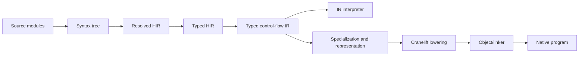

# Implementation architecture

This document defines the implementation architecture required for Lucid to
implement this specification. It replaces descriptions of prototype behavior.
A feature is implemented only when the front end, interpreter, native backend,
diagnostics, and conformance suite agree on its behavior.

Lucid has one semantic pipeline and two ways to execute its result:

The interpreter and native backend execute the same typed control-flow IR. The
native backend may choose a faster representation, but it may not add, omit,
or reinterpret a language rule. This boundary prevents the current failure
mode where the checker accepts a program and a backend later guesses how to
compile it.

## Completion contract

The specification documents define the language. This document defines what
the implementation must prove before it calls a documented feature supported.

For every language rule, the conformance suite contains:

* a program that demonstrates the rule;
* programs that must fail, with the diagnostic category and source span;
* a program that exercises the rule through a public module boundary where
  applicable; and
* an interpreter/native pair with identical observable output and exit status.

Observable behavior includes printed output, returned values, mutations,
raised invariants, recoverable errors, module initialization order, and the
order in which side effects occur. Performance is not observable behavior:
an optimization may change representation and scheduling only when the
program cannot observe the difference.

The compiler rejects an unsupported construct during checking. It never
compiles an unhandled AST case as `none`, skips a declaration, or defers a
known static error to generated C. Such a fallback turns a compiler defect into
silently wrong code.

## Source modules and syntax

The syntax crate owns lossless parsing. Its output has two forms:

* A concrete syntax tree retains every token, comment, delimiter, indentation
  boundary, and source span. The formatter, language server, and recovery
  diagnostics use this tree.
* An abstract syntax tree retains only semantic constructs and spans. Semantic
  analysis consumes this tree.

The lexer owns UTF-8 validation, newline normalization, indentation, string
literals, and lexical errors. The parser owns grammar and precedence. Neither
component decides whether a name is visible, an operator exists, or an
assignment is permitted. Keeping syntax independent of semantics lets the
tooling parse incomplete editor input without inventing runtime behavior.

Every node and token carries a file identifier and half-open byte span. Line
and column positions are derived from a source-file table. Diagnostics retain
the primary span, labelled related spans, a stable error code, and an optional
machine-readable fix. Generated C diagnostics are mapped back through a source
map, but errors caught by Lucid must report Lucid source locations directly.

## Modules, names, and declarations

Before type checking, the compiler constructs a module graph from the project
configuration and imports. It resolves the graph deterministically, rejects
unresolvable and illegal cyclic initialization dependencies, and records one
initialization order. A cycle containing declarations alone is permitted when
all referenced declarations can be resolved before execution; a cycle that
requires a module's top-level value before that module initializes is an error.

Name resolution assigns every declaration a stable `SymbolId`. A resolved name
is never represented by its spelling alone. The resolved high-level IR (HIR)
therefore records, for each use, whether it refers to a local binding, captured
binding, module value, type, trait member, class field, method, overload set,
or builtin.

Resolution runs in these stages:

1. Collect module-level declarations and exports.
2. Resolve imports and build each module's visible namespace.
3. Allocate symbols for type parameters, parameters, local bindings, and
   patterns using the scope rules in [Scope](scope.md).
4. Resolve value and type names, preserving unresolved names as diagnostics
   rather than guessing a builtin.
5. Build overload sets for ordinary dispatch functions and operators.

This pass enforces module-private names and makes shadowing explicit. It also
gives later passes a place to enforce fresh bindings introduced by loops,
destructuring, and call-site captured values.

## The type system

The checker transforms resolved HIR into typed HIR. Each expression has one
canonical type, each coercion is explicit, and each call records the selected
callee or dispatch set. The checker does not mutate a global string-to-type
map while walking source; it uses lexical environments keyed by `SymbolId`.

### Canonical types

The internal type representation has nodes for primitives, nominal classes,
traits, interfaces, functions, anonymous class shapes, unions, type
parameters, and the three mutability views `T`, `~T`, and `!T`. Nominal types
carry their declaration symbol and instantiated arguments, not a printed name.
The type checker interns equivalent types so equality and memoized subtype
queries are reliable.

Type declarations are collected before bodies are checked. This supports
recursive declarations without weakening visibility rules. Generic parameters
record declared variance, bounds, and their declaring symbol. Instantiation
substitutes type arguments structurally, validates bounds, and checks
definition-site variance at every public use.

### Checking rules

The checker uses bidirectional checking:

* An annotation, parameter type, return type, field type, or expected argument
  type checks an expression against a known type.
* An unannotated expression synthesizes a type.
* Assignment and return check that the synthesized type is a subtype of the
  declared or inferred destination type.

Flow-sensitive environments refine union members after type tests, `match`,
and successful result extraction. A join at a control-flow merge keeps only
facts valid on every incoming path. Definite-assignment analysis rejects a
read on a path where no binding exists.

Trait and interface conformance are nominal. The checker resolves trait
composition once, reports conflicting default bodies unless the class supplies
an explicit override, and verifies every inherited obligation against its
substituted signature. A class layout contains fields from its one class parent
followed by its own fields. Traits and interfaces never contribute stored
fields.

### Mutability and freezing

Mutability views are types, not advisory annotations. A mutable `T` can be
viewed as `~T`; a deeply immutable `!T` can be viewed as `~T`; the reverse
conversions require an explicit operation permitted by the specification.
The typed HIR attaches the view of every receiver to field writes, indexed
writes, and mutating method calls. The checker rejects a write when that view
does not permit it.

`freeze` is also a runtime operation because aliases can observe the same
object. It traverses the reachable mutable object graph, marks each object
immutable before visiting outgoing references, and therefore handles cycles.
Runtime write barriers reject a mutation of a frozen object even if foreign or
dynamic code reaches it. The traversal's visited set makes this operation
linear in the reachable graph, not exponential.

### Calls, dispatch, and errors

A direct function call records one `FunctionId` after overload resolution. A
multiple-dispatch call records a `DispatchSetId`, its static argument types,
and the set of candidates visible at the call site. The checker rejects a
statically ambiguous call when no candidate is more specific than every other
applicable candidate.

At runtime, a dispatch set selects the unique most-specific method using the
actual class descriptors of all arguments. The runtime caches that choice by
the dispatch-set identifier and tuple of runtime type identifiers. Adding an
unrelated method cannot change an already resolved direct call; modules expose
dispatch sets according to their import and visibility rules. The same model
implements operators, so operators never rely on Python-style reflected-method
negotiation.

Recoverable errors remain ordinary typed return values. For `value?`, typed HIR
records the success and error partitions of the operand's result type. Lowering
emits one test: on an error it returns that value from the enclosing function;
on success it binds the success value. The checker rejects `?` where the
enclosing return type cannot contain the propagated error. `raise` lowers to
the separate invariant-failure mechanism and is not a hidden second result
channel.

### Patterns and exhaustiveness

Pattern checking destructures the scrutinee type, binds each pattern name with
its narrowed type, and computes the uncovered space after every case. For
finite unions, sealed classes, literals, and anonymous shapes, an uncovered
space is a compile error. For open nominal hierarchies, the compiler requires
an explicit catch-all case. Guards do not establish coverage because a guard
may be false.

## Typed control-flow IR

Typed HIR still resembles source. It is lowered into a control-flow IR (CIR)
with basic blocks, typed local slots, explicit branches, calls, returns,
allocation, field and element operations, and source spans. `if`, loops,
`match`, `?`, `with`, `break`, `continue`, and cleanup all become explicit
control flow.

CIR is the authoritative execution contract. It is simple enough to interpret
and structured enough to compile. It has no unresolved names, implicit
coercions, unchosen overloads, or AST-specific convenience nodes. Every CIR
instruction either has a defined effect or is rejected before a backend sees
it.

The CIR verifier enforces SSA control-flow invariants before execution:
definitions must dominate their uses, and each `Phi` merge must name exactly
one incoming value for every predecessor edge. This keeps branch-selective
evaluation explicit and gives every backend the same validated input.

Closures lower to a function identifier plus an environment object containing
the resolved captured slots. Recursive closures allocate their binding cell
before filling the closure. `Arguments`, `Parameters`, gathering, and spread
lower to typed argument-bundle values; they are not reinterpreted by each
callee.

The initial optimization set is intentionally small and semantics-preserving:
constant folding, unreachable-block removal, local copy propagation, direct
call inlining under a size limit, and representation-aware specialization.
Each optimization runs after CIR validation and before backend lowering.

## Runtime ABI and memory

### Async activations

An `async def` call creates a single-use future. The call captures its
arguments and closure without entering the function body; `await` consumes
that future and resumes the captured activation exactly once. Awaiting a
non-future value is an identity operation, which lets synchronous and
asynchronous APIs compose without adapter wrappers. A second await of the
same future is a runtime error.

Lucid's runtime has one object ABI shared by the CIR interpreter and native
programs. Heap objects begin with a header containing a type descriptor,
mutability state, and lifetime-management fields. The type descriptor contains
the nominal type identifier, parent descriptor, implemented trait and interface
identifiers, field layout, method table, and dispatch metadata.

Values use two representations:

* Typed CIR locals use unboxed machine integers, floats, and booleans whenever
  their static type permits it.
* Heap values and dynamically typed boundaries use a tagged value containing
  either an immediate primitive or an object reference.

This split keeps tight numeric code unboxed without pretending every value is
statically known. Lists, maps, sets, strings, records, closures, result values,
and instances have specified layouts and operations in the runtime, including
bounds checks, equality, hashing, iteration, and error behavior.

The initial runtime uses tracing garbage collection, which handles cycles and
keeps the language's value semantics independent of manual ownership. Native
safe points occur at allocations, calls, loop back edges, and explicit polling
operations. Stack maps generated from CIR identify live object references at
each safe point. The interpreter uses the same collector and descriptors, so a
GC or layout bug cannot hide in only one backend.

The Python 3.13 interoperation promise requires a separate ABI boundary, not a
claim that arbitrary Lucid objects happen to resemble CPython objects. The
`python` runtime target represents interop-visible values as real `PyObject`s
and uses registered `PyTypeObject`s for Lucid nominal types. Conversion-free
interop is supported only for types whose documented layout is the matching
CPython layout; every other crossing uses an explicit adapter. The compiler
must reject a declaration of toll-free interop when its layout cannot meet that
contract. This keeps the promise testable rather than architectural rhetoric.

## Backends

### CIR interpreter

The reference interpreter executes CIR instructions, not parsed AST nodes. It
is the executable oracle for the language and powers the REPL. The REPL parses
and resolves each submission against persistent module and type environments,
then lowers and runs CIR. It may retain compiled CIR blocks, but it never
changes a prior definition without the language's normal rebinding rules.

### Native Cranelift backend

The native backend lowers CIR to Cranelift IR and emits object code directly.
It does not concatenate C fragments while recursively walking Lucid syntax.
The lowering layer owns identifier mangling, declarations, calling
conventions, source mappings, and target-specific ABI details. Every generated
symbol derives from a stable symbol identifier, so an operator spelling or
Unicode name cannot become an invalid target symbol.

Representation selection precedes Cranelift lowering. Closed generic instantiations
that need layout-specific operations are monomorphized; polymorphic code that
crosses an open module boundary receives explicit type descriptors and uses the
uniform tagged-value ABI. Both paths call the same runtime operations and must
produce the same behavior. The build records which specializations it emitted
so incremental builds and diagnostics remain deterministic.

The native runtime boundary uses the pointer-based `NativeResult` ABI exposed
by the code generator. Generated operations write their value and error
discriminant into caller-owned storage, avoiding platform-dependent aggregate
return conventions.

Native builds link Cranelift-produced objects with the versioned Lucid runtime.
The target's optimization level affects speed only. It cannot decide language
semantics, and backend failures retain the mapped Lucid span and CIR operation
needed to diagnose a compiler bug.

## Conformance and release gates

The repository contains three test layers:

* **Specification tests** are small, named programs organized by the document
  and rule they cover. They test parse success, static diagnostics, and output.
* **Backend parity tests** execute every runnable specification program in the
  CIR interpreter and as a native binary, then compare observable behavior.
* **Property and regression tests** generate syntax and type combinations,
  minimize failures, and retain every fixed compiler bug as a regression.

Documentation examples are tests only when they declare an expected outcome;
the test harness extracts and runs them. A prose-only example cannot silently
claim support. The feature matrix records each documented feature as
`specified`, `interpreter`, `native`, and `conformant`; the public support
statement may list only features in the final state.

A release requires a clean parser/checker build, all specification tests,
native parity on every supported target, deterministic output for repeated
builds, and a documented compatibility upgrade path consistent with
[Zero-deprecation](principles.md#zero-deprecation).

## Migration from the prototype

The existing lexer and parser can remain as the syntax front end after they
gain lossless trees and recovery. The existing AST interpreter and direct C
emitter must not be extended as parallel semantic authorities. The migration
is ordered by dependency:

1. Introduce source files, symbols, module resolution, diagnostics, and
   resolved HIR while retaining the current AST evaluator as a temporary test
   oracle.
2. Implement canonical types and typed HIR, then port each existing checker
   rule with conformance tests.
3. Lower typed HIR to validated CIR and replace the AST evaluator with the CIR
   interpreter.
4. Build the runtime ABI, collections, closures, dispatch tables, freezing,
   and module initialization behind CIR instructions.
5. Replace the direct C emitter with representation selection and Cranelift
   lowering. Add native parity before declaring any feature natively
   supported.
6. Add generic specialization, the Python ABI target, optimization passes, and
   the language-server-facing syntax APIs after semantic parity is established.

At each step, unsupported constructs fail at the front-end boundary rather
than falling back to the old backend. This gives every feature one migration
point and prevents a growing compatibility layer from becoming the new
implementation.

The next architectural dependency is the precise static semantics in
[Type vocabulary](types.md), [Generics](generics.md), [Multiple dispatch](dispatch.md),
and [Results](results.md). Those rules determine the typed HIR contracts that
every execution backend shares.
